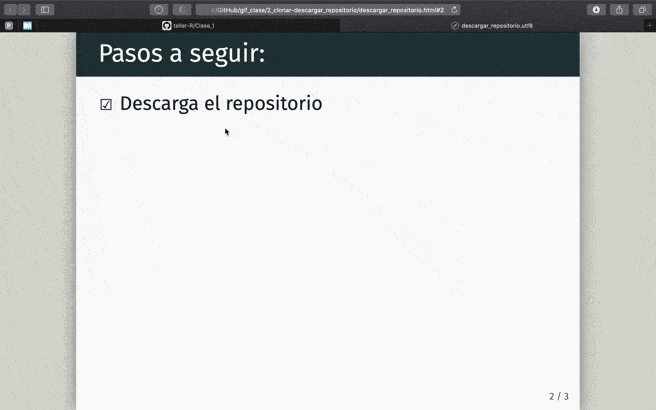

  

# 1. Descargar la clase

Puedes replicar esta clase de 3 diferentes formas:

- 1.1. Descargar repositorio manualmente.
- 1.2. Crear proyecto con versión de control de Git.
- 1.3. Clonar el repositorio desde la terminal.

## 1.1. Descargando el repositorio manualmente. 

 

## 1.2. Crear proyecto con versión de control de Git.

Para hacerlo de esta forma, debes tener instalado [Git](https://git-scm.com/downloads) en tu equipo.

 

## 1.3. Clonar el repositorio desde la terminal.

Para hacerlo de esta forma, debes tener instalado [Git](https://git-scm.com/downloads) en tu equipo.

